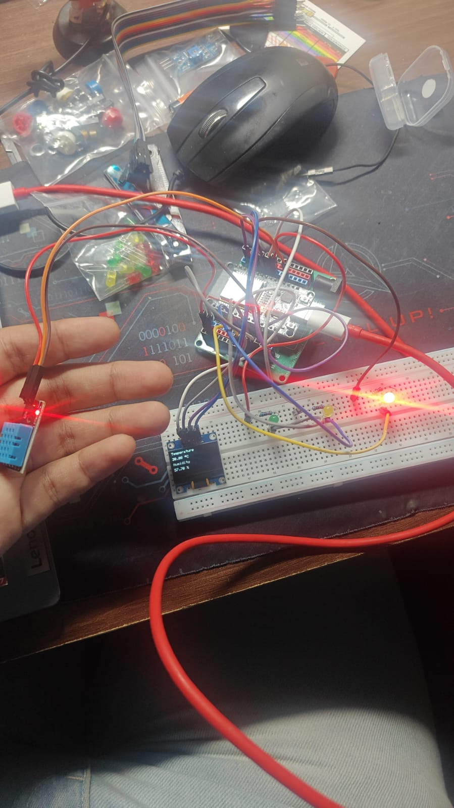

# 🌡️ Project 5 - Temperature & Humidity Monitor (Version 3)

## 📖 Overview

This version enhances the Temperature & Humidity Monitor by introducing **temperature-based visual indicators** using LEDs. The ESP32 continuously monitors the ambient temperature using the DHT11 sensor, displays the readings on the OLED display, and illuminates a corresponding LED based on the measured temperature range.

This project demonstrates how embedded systems can not only monitor environmental conditions but also react to them.

---

## 🎯 Objectives

- Read temperature and humidity data from the DHT11 sensor.
- Display live readings on the OLED display.
- Use LEDs to visually indicate different temperature ranges.
- Organize the program using modular helper functions.

---

## 🛠️ Components Used

- ESP32 Development Board
- DHT11 Temperature & Humidity Sensor
- 0.96" SSD1306 OLED Display (I2C)
- Green LED
- Yellow LED
- Red LED
- 3 × 220 Ω Resistors
- Breadboard
- Jumper Wires
- USB Cable

---

## 🔌 Circuit Connections

### DHT11 Connections

| DHT11 | ESP32 |
|--------|-------|
| VCC | 3.3V |
| GND | GND |
| DATA | GPIO 4 |

### OLED Connections

| OLED | ESP32 |
|------|-------|
| VCC | 3.3V |
| GND | GND |
| SDA | GPIO 21 |
| SCL | GPIO 22 |

### LED Connections

| LED | ESP32 GPIO |
|-----|------------|
| Green | GPIO 5 |
| Yellow | GPIO 18 |
| Red | GPIO 19 |

---

## 📚 Libraries Used

- Wire
- Adafruit GFX Library
- Adafruit SSD1306 Library
- DHT Sensor Library by Adafruit
- Adafruit Unified Sensor

---

## ⚙️ How It Works

1. The ESP32 reads the temperature and humidity from the DHT11 sensor.
2. The OLED display is updated with the latest readings.
3. The measured temperature is compared against predefined temperature ranges.
4. Based on the result:
   - Green LED indicates a lower temperature.
   - Yellow LED indicates a moderate temperature.
   - Red LED indicates a higher temperature.

---

## 🌡️ Temperature Indicator Logic

| Temperature | LED |
|-------------|-----|
| Below 27.5°C | 🟢 Green |
| 27.5°C – 28°C | 🟡 Yellow |
| Above 28°C | 🔴 Red |

> **Note:** These temperature thresholds were intentionally chosen for testing purposes. Since it was not practical to simulate extremely cold or hot environments during development, the thresholds were adjusted close to the ambient room temperature. This allowed each LED condition to be tested and verified by slightly changing the sensor temperature, such as by holding the sensor in hand.

---

## 💻 Example Display

```text
Temperature

28.1 °C

Humidity
64 %
```

---

## 📖 Concepts Learned

- Digital Sensor Interfacing
- OLED Display Programming
- Temperature-Based Decision Making
- Conditional Statements (`if` / `else if` / `else`)
- Function-Based Programming
- Modular Code Organization
- Real-Time Sensor Monitoring

---

## 🚀 Future Improvements

- Add a buzzer alarm for high temperatures.
- Allow users to configure temperature thresholds using push buttons.
- Display a comfort indicator based on both temperature and humidity.
- Add graphical icons to improve the OLED interface.

---

## 📷 Project Images

### Circuit Diagram



### Serial Monitor


---

## 🏁 Conclusion

This version transforms the project from a passive monitoring system into a simple environmental indicator. By combining sensor readings with decision-making logic, the ESP32 can now react to changes in temperature and provide immediate visual feedback through LEDs. This project serves as an introduction to real-time monitoring and control systems commonly found in embedded applications.