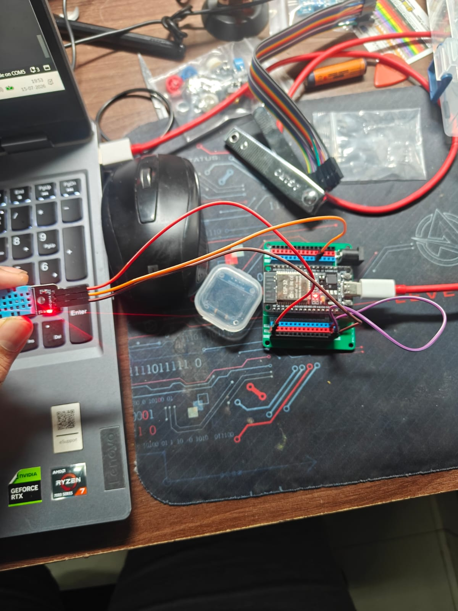
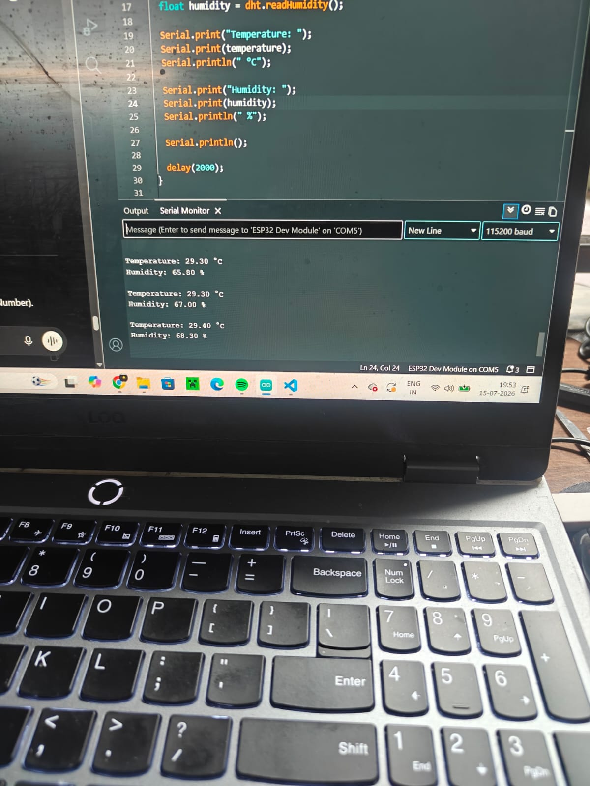

# 🌡️ Project 5 - Temperature & Humidity Monitor (Version 1)

## 📖 Overview

This project uses the **DHT11 Temperature and Humidity Sensor** with an **ESP32** to measure environmental conditions and display the readings on the **Serial Monitor**.

The DHT11 is a digital sensor capable of measuring both temperature and relative humidity, making it an excellent introduction to working with digital sensors in embedded systems.

---

## 🎯 Objectives

- Learn how to interface a digital sensor with the ESP32.
- Read temperature and humidity values using the DHT11.
- Display sensor readings on the Serial Monitor.
- Understand the use of external Arduino libraries.

---

## 🛠️ Components Used

- ESP32 Development Board
- DHT11 Temperature & Humidity Sensor
- Breadboard
- Jumper Wires
- USB Cable

---

## 🔌 Circuit Connections

| DHT11 | ESP32 |
|--------|-------|
| VCC | 3.3V |
| GND | GND |
| DATA | GPIO 4 |

> **Note:** If you are using a bare DHT11 sensor (4-pin), a 10kΩ pull-up resistor is required between VCC and DATA. Most DHT11 modules already include this resistor.

---

## 📚 Libraries Used

- DHT Sensor Library by Adafruit
- Adafruit Unified Sensor

---

## ⚙️ How It Works

1. The ESP32 initializes the DHT11 sensor.
2. Every 2 seconds, it reads:
   - Temperature (°C)
   - Relative Humidity (%)
3. The readings are displayed on the Serial Monitor.

---

## 💻 Example Output

```text
Temperature: 28.9 °C
Humidity: 65 %

Temperature: 29.0 °C
Humidity: 65 %
```

---

## 📖 Concepts Learned

- Digital Sensor Interfacing
- Reading Temperature and Humidity Data
- Using External Arduino Libraries
- Serial Communication
- Floating-Point Variables
- Basic Sensor Error Handling

---

## 🚀 Future Improvements

- Display sensor readings on an OLED display.
- Add LEDs to indicate different temperature ranges.
- Trigger a buzzer when the temperature exceeds a set threshold.
- Display a comfort indicator based on temperature and humidity.
- Allow users to adjust the temperature threshold using push buttons.

---

## 📷 Project Images

### Circuit Diagram



### Serial Monitor



---

## 🏁 Conclusion

This project introduces digital environmental sensing using the DHT11 and ESP32. It lays the foundation for more advanced embedded applications involving sensors, displays, alarms, and user interaction in the upcoming versions of this project.