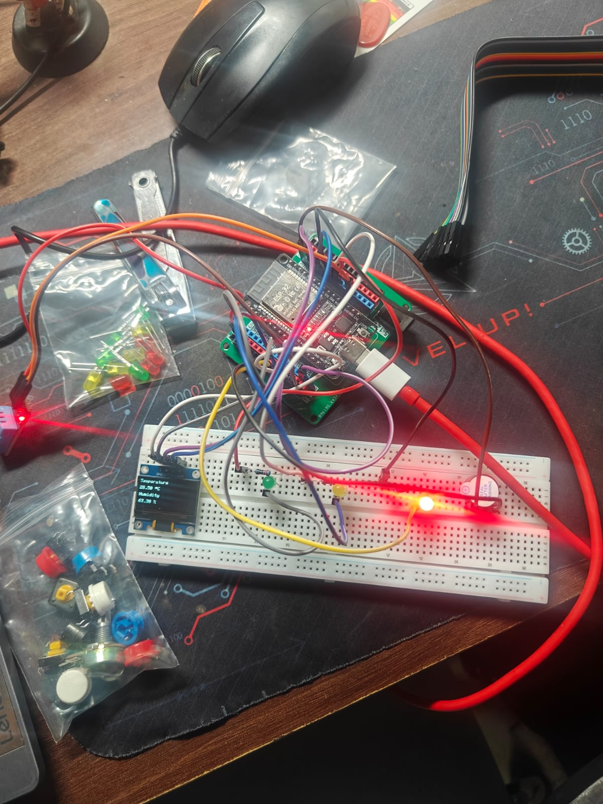

# 🌡️ Project 5 - Temperature & Humidity Monitor (Version 4)

## 📖 Overview

This version enhances the Temperature & Humidity Monitor by introducing an **audible temperature alarm** using a passive buzzer. In addition to displaying temperature and humidity on the OLED and indicating the temperature range using LEDs, the ESP32 now alerts the user with a buzzer whenever the temperature exceeds a predefined threshold.

This project demonstrates how embedded systems can monitor environmental conditions and provide both **visual** and **audible** feedback based on sensor readings.

---

## 🎯 Objectives

- Read temperature and humidity data from the DHT11 sensor.
- Display live sensor readings on the OLED display.
- Indicate different temperature ranges using LEDs.
- Trigger an audible alarm when the temperature exceeds a specified threshold.
- Continue improving modular programming by separating display, LED, and buzzer functionality into dedicated helper functions.

---

## 🛠️ Components Used

- ESP32 Development Board
- DHT11 Temperature & Humidity Sensor
- 0.96" SSD1306 OLED Display (I2C)
- Passive Buzzer
- Green LED
- Yellow LED
- Red LED
- 3 × 220 Ω Resistors
- Breadboard
- Jumper Wires
- USB Cable

---

## 🔌 Circuit Connections

### DHT11 Connections

| DHT11 | ESP32 |
|--------|-------|
| VCC | 3.3V |
| GND | GND |
| DATA | GPIO 4 |

### OLED Connections

| OLED | ESP32 |
|------|-------|
| VCC | 3.3V |
| GND | GND |
| SDA | GPIO 21 |
| SCL | GPIO 22 |

### LED Connections

| LED | ESP32 GPIO |
|-----|------------|
| Green | GPIO 5 |
| Yellow | GPIO 18 |
| Red | GPIO 19 |

### Passive Buzzer Connections

| Passive Buzzer | ESP32 |
|----------------|-------|
| + | GPIO 23 |
| - | GND |

---

## 📚 Libraries Used

- Wire
- Adafruit GFX Library
- Adafruit SSD1306 Library
- DHT Sensor Library by Adafruit
- Adafruit Unified Sensor

---

## ⚙️ How It Works

1. The ESP32 reads the temperature and humidity from the DHT11 sensor.
2. The OLED display is updated with the latest sensor readings.
3. The measured temperature is compared against predefined temperature ranges.
4. One of the three LEDs is illuminated to indicate the current temperature range.
5. If the temperature exceeds the alarm threshold, the passive buzzer is activated to alert the user.

---

## 🌡️ Temperature Indicator Logic

| Temperature | Indicator |
|-------------|-----------|
| Below 27.5°C | 🟢 Green LED |
| 27.5°C – 28°C | 🟡 Yellow LED |
| Above 28°C | 🔴 Red LED + 🔊 Buzzer |

> **Note:** The temperature thresholds were intentionally chosen close to the ambient room temperature. Since it was not practical to simulate extreme cold or hot environments during development, the thresholds were adjusted to allow each condition to be tested by slightly changing the sensor temperature, such as by holding the sensor in hand.

---

## 💻 Example Display

```text
Temperature

28.3 °C

Humidity
63 %
```

---

## 📖 Concepts Learned

- Digital Sensor Interfacing
- OLED Display Programming
- Temperature-Based Decision Making
- Passive Buzzer Control using PWM
- Multiple Output Device Integration
- Function-Based Programming
- Modular Code Organization
- Real-Time Environmental Monitoring

---

## 🚀 Future Improvements

- Allow users to adjust the alarm threshold using push buttons.
- Store alarm threshold values in non-volatile memory.
- Display warning messages on the OLED when the alarm is active.
- Log temperature history for trend analysis.
- Transmit sensor data over Wi-Fi for remote monitoring.

---

## 📷 Project Images

### Circuit Diagram



### Serial Monitor


---

## 🏁 Conclusion

Version 4 transforms the project into a complete environmental monitoring and alert system. By integrating a passive buzzer alongside the OLED display and LED indicators, the ESP32 can now provide immediate visual and audible feedback whenever the monitored temperature exceeds the configured threshold. This project demonstrates how multiple peripherals can work together to create a practical real-time embedded monitoring application.