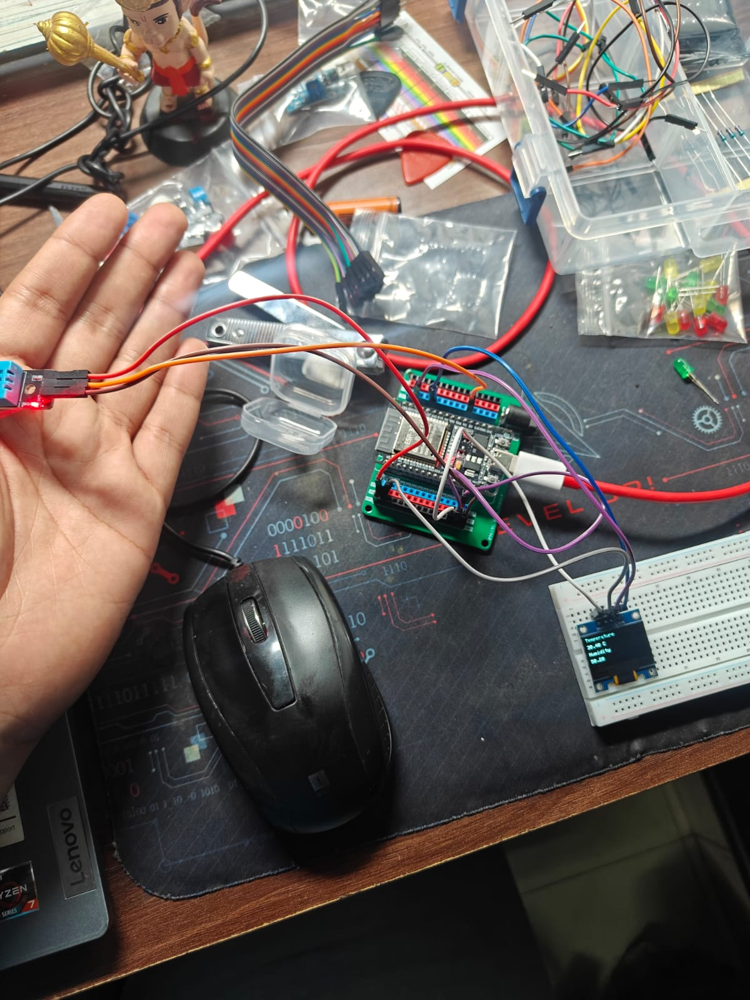
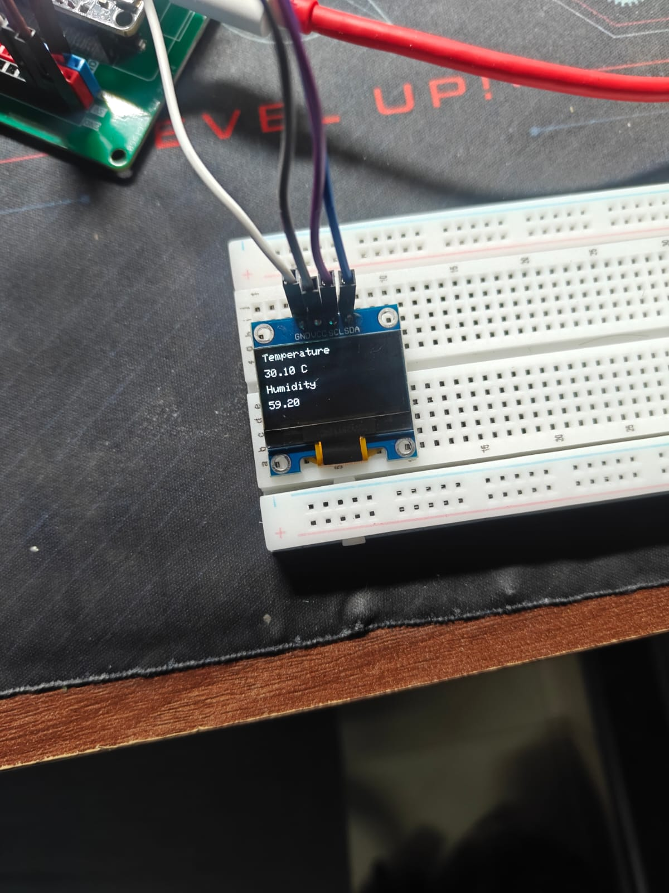

# 🌡️ Project 5 - Temperature & Humidity Monitor (Version 2)

## 📖 Overview

This project builds upon Version 1 by displaying real-time **temperature** and **humidity** readings from the **DHT11 sensor** on a **0.96-inch SSD1306 OLED display** instead of the Serial Monitor.

By combining sensor interfacing with a graphical display, this project demonstrates how embedded systems present real-time environmental data to users.

---

## 🎯 Objectives

- Interface the DHT11 sensor with the ESP32.
- Read temperature and humidity data.
- Display live sensor readings on an OLED display.
- Organize the program using helper functions for improved readability and modularity.

---

## 🛠️ Components Used

- ESP32 Development Board
- DHT11 Temperature & Humidity Sensor
- 0.96" SSD1306 OLED Display (I2C)
- Breadboard
- Jumper Wires
- USB Cable

---

## 🔌 Circuit Connections

### DHT11 Connections

| DHT11 | ESP32 |
|--------|-------|
| VCC | 3.3V |
| GND | GND |
| DATA | GPIO 4 |

### OLED Connections

| OLED | ESP32 |
|------|-------|
| VCC | 3.3V |
| GND | GND |
| SDA | GPIO 21 |
| SCL | GPIO 22 |

> **Note:** Most OLED modules use the I2C address **0x3C**.

---

## 📚 Libraries Used

- Wire
- Adafruit GFX Library
- Adafruit SSD1306 Library
- DHT Sensor Library by Adafruit
- Adafruit Unified Sensor

---

## ⚙️ How It Works

1. The ESP32 initializes the OLED display and the DHT11 sensor.
2. Every 2 seconds, the DHT11 measures:
   - Temperature (°C)
   - Relative Humidity (%)
3. The sensor readings are validated to ensure successful communication.
4. The OLED display is updated with the latest temperature and humidity values.

---

## 💻 Example Display

```text
Temperature

29.1 °C

Humidity: 65 %
```

---

## 📖 Concepts Learned

- Digital Sensor Interfacing
- OLED Display Programming
- I2C Communication
- Displaying Real-Time Sensor Data
- Function-Based Code Organization
- Floating-Point Variables
- Basic Sensor Error Handling

---

## 🚀 Future Improvements

- Add LEDs to indicate different temperature ranges.
- Trigger a buzzer when the temperature exceeds a threshold.
- Display a comfort indicator based on temperature and humidity.
- Allow users to configure temperature limits using push buttons.
- Add simple graphics or icons to improve the user interface.

---

## 📷 Project Images

### Circuit Diagram



### Serial Monitor



---

## 🏁 Conclusion

This version expands the project by introducing a graphical user interface using an OLED display. Instead of monitoring data through the Serial Monitor, the ESP32 now provides live temperature and humidity readings directly on the display, creating a more practical and user-friendly embedded monitoring system.